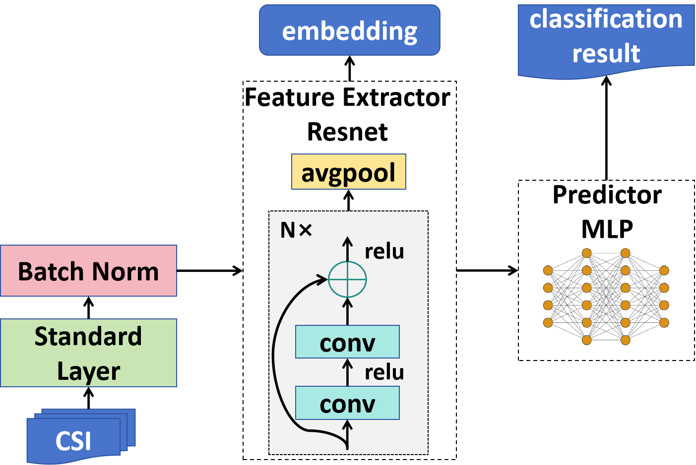

# KNN-MMD

**Article:** Zijian Zhao, Zhijie Cai, Tingwei Chen, Xiaoyang Li, Hang Li, Qimei Chen, Guangxu Zhu*, "[KNN-MMD: Cross Domain Wireless Sensing via Local Distribution Alignment](https://arxiv.org/abs/2412.04783) "(under review, IEEE Transactions on Mobile Computing (TMC))


## 1. Data

### 1.1 Dataset

Public Dataset: [WiGesture](https://paperswithcode.com/dataset/wigesture)

Proposed Dataset: WiFall (./WiFall)


### 1.2 Data Preparation

Refer to [RS2002/CSI-BERT: Official Repository for The Paper, Finding the Missing Data: A BERT-inspired Approach Against Package Loss in Wireless Sensing (github.com)](https://github.com/RS2002/CSI-BERT)


## 2. Run the model



To run the model, follow these instructions based on the dataset you are using. For the WiGesture Dataset, use the `train.py` script, and for the WiFall Dataset, use the `train_fall.py` script. The steps to execute them are the same, and here we provide an example using `train.py`.

```
python train.py --k <shot number> --n <neighbor number for KNN> --p <select the top p samples from testing set for MK-MMD (p<1)> --task <action or people> --lr <learning rate>
```

Make sure to replace the following placeholders with the appropriate values:

- `<shot number>`: Specify the shot number.
- `<neighbor number for KNN>`: Specify the number of neighbors for KNN.
- `<select the top p samples from testing set for MK-MMD (p<1)>`: Specify the value for p (selecting the top p samples from the testing set for MK-MMD). Note that p should be less than 1.
- `<action or people>`: Specify the task name as either "action" or "people".
- `<learning rate>`: Specify the desired learning rate.

Once you have set the appropriate values, run the command in your terminal to start the training process.

## 3. Reference

```
@misc{zhao2025knnmmdcrossdomainwireless,
      title={KNN-MMD: Cross Domain Wireless Sensing via Local Distribution Alignment}, 
      author={Zijian Zhao and Zhijie Cai and Tingwei Chen and Xiaoyang Li and Hang Li and Qimei Chen and Guangxu Zhu},
      year={2025},
      eprint={2412.04783},
      archivePrefix={arXiv},
      primaryClass={cs.CV},
      url={https://arxiv.org/abs/2412.04783}, 
}
```

