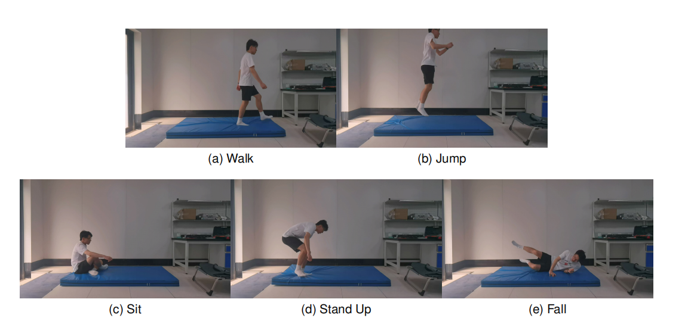
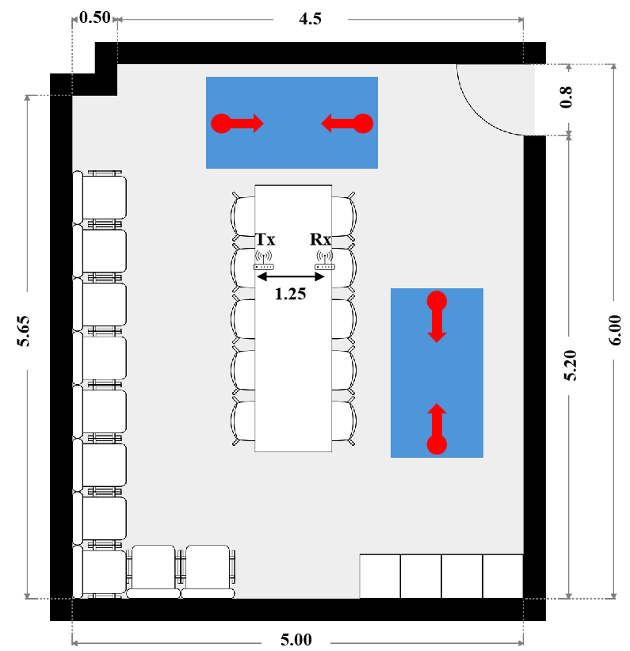

# WiFall: Wireless Sensing Dataset for Fall Detection, Action Recognition and People ID Identification with ESP32-S3

The data format and collection configuration of WiFall is same as [WiGesture Dataset | Papers With Code](https://paperswithcode.com/dataset/wigesture).

## 1. Dataset Overview

WiFall dataset contains data related to **fall detection, action recognition and people id identification** in a meeting room scenario. The dataset provides synchronised CSI, RSSI, and timestamp for each sample.

## 2. Data Format

The WiFall dataset consists of multiple .csv files. The dataset contains the following columns:

1. Column B - "seq": This column indicates the row number of each entry.
2. Column C - "timestamp" and Column V - "local_timestamp": These columns represent the UTC+8 time and ESP local time, respectively, when the data was collected.
3. Column G - "rssi": This column represents the RSSI signal.
4. Column AB - "data": This column contains the CSI data. Each row consists of 104 numbers, which can be divided into pairs representing the real and imaginary parts of each subcarrier. Therefore, the complex CSI value of the ith subcarrier can be obtained as a[2i] + a[2i+1]j. In other words, the CSI value of the 52 subcarriers can be represented as [a[1]+a[2]j, a[3]+a[4]j, ..., a[103]+a[104]j].
5. Other columns: These columns provide additional information from the ESP32 device, such as MAC and MCS details.

## 3. Data Collection Detail

|                |                         |
| -------------- | ----------------------- |
| Frequency Band | 2.4Ghz                  |
| Bandwidth      | 20 MHz (52 subcarriers) |
| Protocol       | 802.11n                 |
| Waveform       | OFDM                    |
| Sampling rate  | About 100Hz             |
| Antenna        | 1 antenna per device    |

## 4. File Tree Structure

The filename represents the action of the sample, while its parent root indicates the person's ID.

 Root Directory
  |
  |
  |-- ID0
  |    |
  |    |-- fall
  |    |-- Jump
  |    |-- sit
  |    |-- stand
  |    |-- walk
  |    |
  |-- ID1
  |    |
  |    |-- fall
  |    |-- Jump
  |    |-- sit
  |    |-- stand
  |    |-- walk
  |    |
  |-- ID2
  |    |
  |    |-- fall
  |    |-- Jump
  |    |-- sit
  |    |-- stand
  |    |-- walk
  |    |
  |-- ID3
  |    |
  |    |-- fall
  |    |-- Jump
  |    |-- sit
  |    |-- stand
  |    |-- walk
  |    |
  |-- ID4
  |    |
  |    |-- fall
  |    |-- Jump
  |    |-- sit
  |    |-- stand
  |    |-- walk
  |    |
  |-- ID5
  |    |
  |    |-- fall
  |    |-- Jump
  |    |-- sit
  |    |-- stand
  |    |-- walk
  |    |
  |-- ID6
  |    |
  |    |-- fall
  |    |-- Jump
  |    |-- sit
  |    |-- stand
  |    |-- walk
  |    |
  |-- ID7
  |    |
  |    |-- fall
  |    |-- Jump
  |    |-- sit
  |    |-- stand
  |    |-- walk
  |    |
  |-- ID8
  |    |
  |    |-- fall
  |    |-- Jump
  |    |-- sit
  |    |-- stand
  |    |-- walk
  |    |
  |-- ID9
  |    |
  |    |-- fall
  |    |-- Jump
  |    |-- sit
  |    |-- stand
  |    |-- walk
